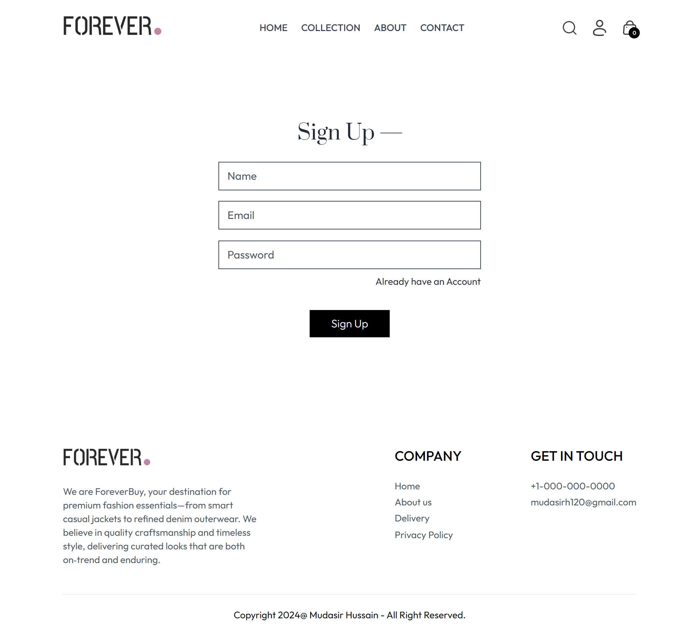
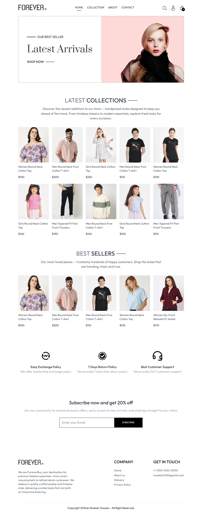
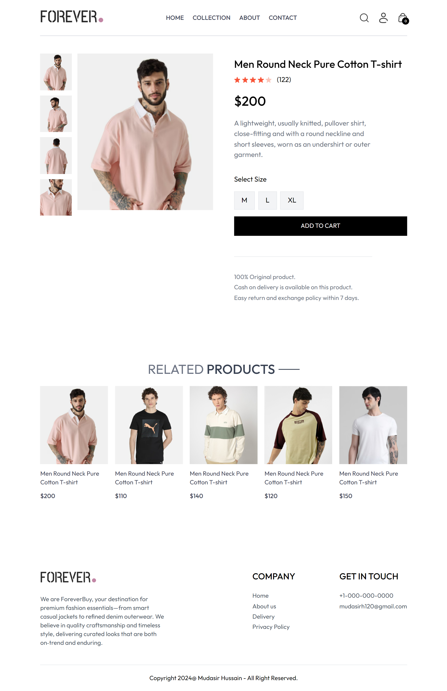
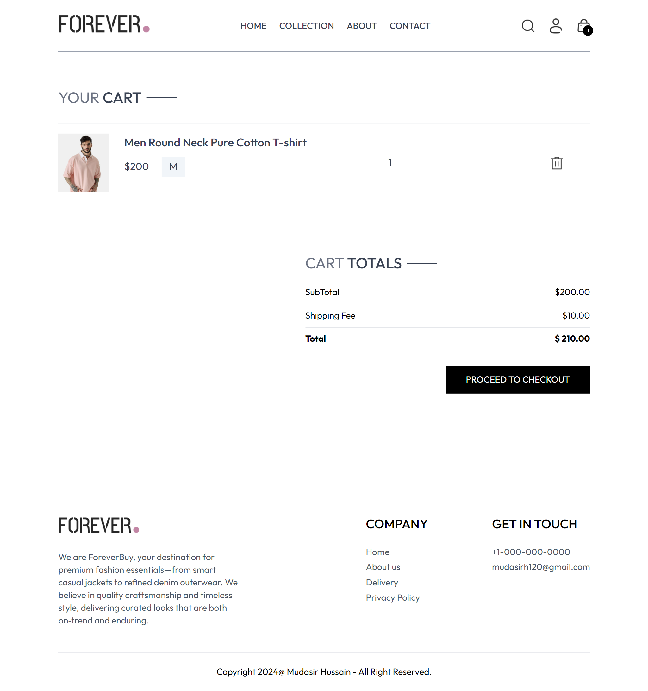
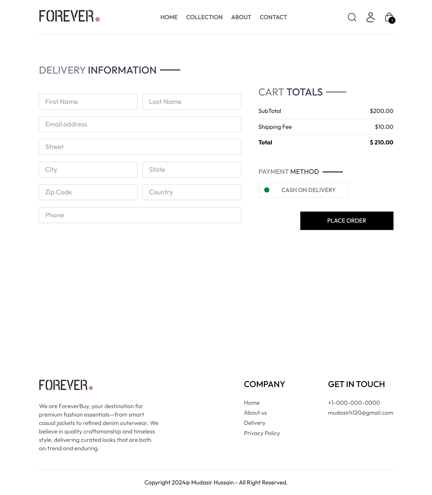

# Forever E-Commerce 🛒

A **full-stack MERN E-Commerce platform** with a modern UI, secure authentication, product management, and an integrated admin dashboard.

---

## ✨ Features

### User Features

- 👤 User authentication
- 🛍️ Browse products
- 🔍 Search products by name
- 🛒 Add to cart & checkout
- 💳 Place orders (Cash on Delivery supported Stripe later)
- 📦 View orders and status

### Admin Features

- 🔐 Secure login
- ➕ Add, ✏️ Edit, ❌ Delete products
- 📂 Upload product images (via Cloudinary)
- 📊 Manage orders from dashboard
- 🚀 Clean and responsive admin UI

---

## 🛠️ Tech Stack

**Frontend & Admin Panel**

- React
- React Router
- Tailwind CSS
- Axios
- React Toastify

**Backend**

- Express
- MongoDB + Mongoose
- JWT + bcrypt (authentication & security)
- Multer + Cloudinary (image uploads)
- Stripe (payment integration "future")
- Validator (form validation)

---

**Note that [Forever Frontend](https://github.com/Mudasirh120/Forver--MERN-Frontend) is needed for this to work.**

---

## ⚡ Installation & Setup

1. **Clone the repository**
   ```bash
   git clone https://github.com/Mudasirh120/Forver--MERN-Backend.git
   cd Forever-MERN-Backend
   ```
2. Install Dependencies
   ```bash
   npm install
   ```
3. Create a .env file
   ```bash
   CLOUDINARY_CLOUDNAME="your_cloudinary_cloudname"
   CLOUDINARY_APIKEY="your_cloudinary_apikey"
   CLOUDINARY_SECRET="your_cloudinary_secret"
   JWT_SECRET="your_jwt_secret"
   NODE_ENV = "development"
   ADMIN_EMAIL="your_admin_email"
   ADMIN_PASSWORD="your_admin_password"
   FRONTEND_URL="http://localhost:5173"
   ADMIN_URL="http://localhost:5174"
   ```
4. Run project
   ```bash
   npm run dev
   ```

---

## 📸 Screenshots








